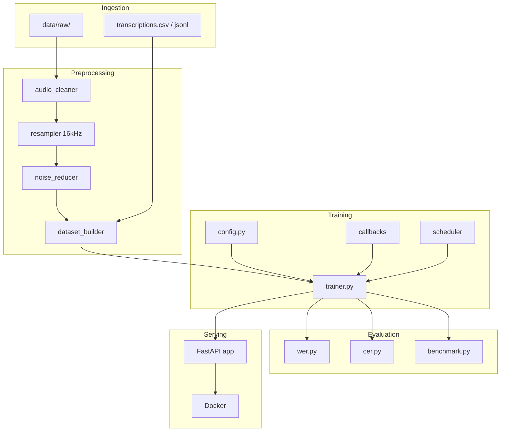

# Whisper Fine-Tuning Pipeline

Production-ready end-to-end Automatic Speech Recognition (ASR) pipeline using OpenAI Whisper fine-tuning. Designed for **low-resource languages** including **Amharic** (`am`) and **Afaan Oromo** (`om`), with scalability, maintainability, testing, and deployment built in.

## Features

- **Preprocessing**: silence trimming, normalization, resampling (16 kHz mono), noise reduction, Hugging Face dataset building
- **Training**: Hugging Face `Seq2SeqTrainer`, mixed precision, multi-GPU (DDP), checkpointing, early stopping, resume support
- **Evaluation**: WER, CER (language-aware), latency/throughput/memory benchmarking
- **API**: FastAPI REST service with `/transcribe`, `/health`, `/metrics`
- **Ops**: structured logging, Docker (GPU), pytest (≥85% coverage target), exploratory notebook

## Architecture



## Project Structure

```
whisper-finetune-pipeline/
├── data/raw|processed|augmented/   # Audio data stages
├── preprocessing/                  # Audio cleaning, resampling, datasets
├── training/                       # Config, trainer, callbacks, schedulers
├── evaluation/                     # WER, CER, benchmarking
├── api/                            # FastAPI inference service
├── tests/                          # Pytest suite
├── notebooks/                      # EDA notebook
├── scripts/                        # CLI entry points
├── config/default.yaml             # Pipeline configuration
├── Dockerfile
├── requirements.txt
└── README.md
```

## Requirements

- Python 3.11+
- CUDA-capable GPU (recommended for training; CPU supported for inference)
- FFmpeg (for audio decoding in Docker/system)

## Installation

```bash
cd whisper-finetune-pipeline
python -m venv .venv
source .venv/bin/activate
pip install --upgrade pip

# GPU (CUDA 12.1)
pip install torch torchaudio --index-url https://download.pytorch.org/whl/cu121
pip install -r requirements.txt

# CPU only
pip install torch torchaudio --index-url https://download.pytorch.org/whl/cpu
pip install -r requirements.txt
```

## Dataset Preparation

### 1. Organize raw data

Place audio files in `data/raw/` and create a transcription manifest.

**CSV format** (`data/raw/transcriptions.csv`):

```csv
file,text,speaker
utterance_001.wav,ሰላም እንዴት ነህ,speaker_01
utterance_002.wav,nagaan buli,speaker_02
```

Supported manifest formats: CSV, TSV, JSON, JSONL, pipe-delimited text.

### 2. Configure language

Edit `config/default.yaml`:

```yaml
model:
  language: am   # or 'om' for Afaan Oromo
```

### 3. Run preprocessing

```bash
python scripts/run_preprocess.py --config config/default.yaml
```

This pipeline:
1. Cleans and validates audio
2. Resamples to 16 kHz mono
3. Applies noise reduction
4. Builds train/validation/test Hugging Face dataset
5. Exports statistics to `data/processed/dataset_statistics.json`

## Training

```bash
python scripts/run_train.py --config config/default.yaml
```

Resume from checkpoint:

```bash
python scripts/run_train.py --config config/default.yaml --resume checkpoints/checkpoint-1000
```

Key environment variables:

| Variable | Description |
|----------|-------------|
| `WHISPER_MODEL_NAME` | Base model (default: `openai/whisper-small`) |
| `WHISPER_MODEL_LANGUAGE` | Language code (`am`, `om`) |
| `TRAINING_NUM_TRAIN_EPOCHS` | Number of epochs |
| `TRAINING_LEARNING_RATE` | Learning rate |
| `TRAINING_OUTPUT_DIR` | Checkpoint directory |

TensorBoard logs: `logs/tensorboard/`

## Evaluation

```bash
python scripts/run_evaluate.py --config config/default.yaml --split test --benchmark
```

Outputs:
- `evaluation_results/evaluation_report.json` — WER/CER aggregates
- `evaluation_results/benchmark_report.json` — latency, throughput, memory
- `evaluation_results/benchmark_report.csv` — tabular summary

## API Usage

### Start server locally

```bash
uvicorn api.app:app --host 0.0.0.0 --port 8000 --reload
```

Set model path:

```bash
export API_MODEL_PATH=checkpoints/best
```

### Endpoints

#### `GET /health`

```bash
curl http://localhost:8000/health
```

```json
{
  "status": "healthy",
  "model_loaded": true,
  "device": "cuda",
  "uptime_seconds": 123.45
}
```

#### `GET /metrics`

```bash
curl http://localhost:8000/metrics
```

#### `POST /transcribe`

```bash
curl -X POST http://localhost:8000/transcribe \
  -F "audio_file=@sample.wav"
```

```json
{
  "transcription": "recognized text",
  "language": "am",
  "duration_seconds": 3.2,
  "inference_time_ms": 245.1
}
```

Interactive docs: http://localhost:8000/docs

## Docker Deployment

### Build

```bash
docker build -t whisper-asr:latest .
```

### Run (GPU)

```bash
docker run --gpus all \
  -p 8000:8000 \
  -v $(pwd)/checkpoints/best:/app/checkpoints/best:ro \
  -e API_MODEL_PATH=checkpoints/best \
  -e WHISPER_MODEL_LANGUAGE=am \
  whisper-asr:latest
```

### Run (CPU)

```bash
docker run -p 8000:8000 \
  -v $(pwd)/checkpoints/best:/app/checkpoints/best:ro \
  whisper-asr:latest
```

Health check is configured in the Dockerfile (`GET /health` every 30s).

## Testing

```bash
pytest
```

With coverage report:

```bash
pytest --cov=preprocessing --cov=training --cov=evaluation --cov=api --cov-report=term-missing
```

Coverage threshold is configured at 85% in `pyproject.toml`.

## Logging

Structured JSON logs are written to:
- `logs/training.log` — training pipeline
- `logs/api.log` — inference service
- `logs/metrics.jsonl` — step-level training metrics

Configure via `config/default.yaml` or `LOG_LEVEL=DEBUG`.

## Language Support Notes

| Language | Code | Script | CER Mode |
|----------|------|--------|----------|
| Amharic | `am` | Ethiopic (Ge'ez) | Ethiopic normalization |
| Afaan Oromo | `om` | Latin (typically) | Latin normalization |

Whisper supports both languages out of the box; fine-tuning improves domain-specific vocabulary and accent robustness.

## Troubleshooting

### Model not loaded (API returns 503)

- Verify `API_MODEL_PATH` points to a directory containing `config.json`, model weights, and processor files
- Run training first or download a fine-tuned checkpoint

### CUDA out of memory

- Reduce `per_device_train_batch_size` in config
- Increase `gradient_accumulation_steps`
- Use a smaller base model (`whisper-tiny`, `whisper-base`)

### Empty dataset after preprocessing

- Check `data/raw/transcriptions.csv` paths match audio filenames
- Verify audio passes validation (duration 0.5–30s by default)
- Inspect logs for skipped files

### High WER after training

- Increase training data volume and epochs
- Verify transcription quality and normalization
- Try unfreezing encoder (`freeze_encoder: false`)
- Evaluate on held-out test split with `scripts/run_evaluate.py`

### Docker health check failing

- Allow 60s startup period for model loading
- Ensure port 8000 is exposed and curl is available in container

## License

MIT — see repository license file for details.

## Contributing

1. Fork the repository
2. Create a feature branch
3. Run `pytest` and ensure coverage ≥ 85%
4. Submit a pull request
# Architecture: raw audio -> preprocess -> train -> evaluate -> serve via API
